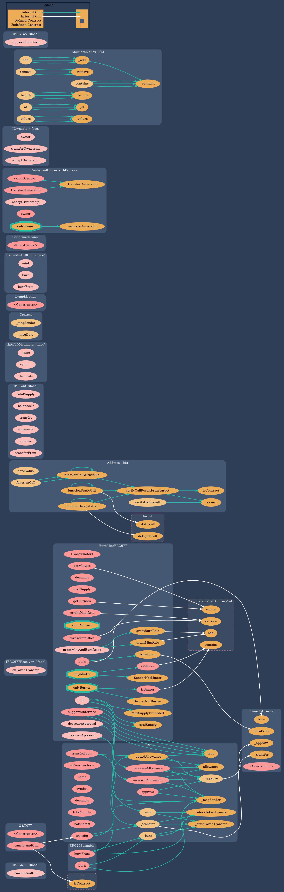
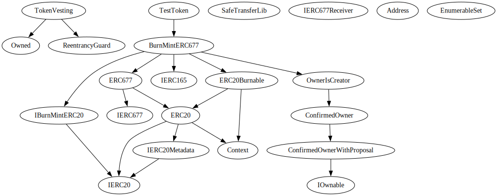
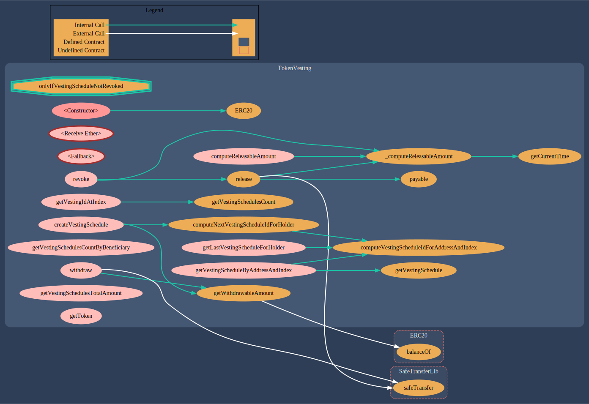

# $LYP

- $LYP token and vesting solidity contracts foundry project

## Wiki

### Integrations

- [CCIP](https://docs.chain.link/ccip)

### Vendors

- [OpenZeppelin v4.8.0](https://github.com/OpenZeppelin/openzeppelin-contracts/tree/release-v4.8)
- [Solmate v6](https://github.com/transmissions11/solmate)

## References

- [CCIP Source Code](https://github.com/smartcontractkit/ccip/tree/ccip-audit/1.2/contracts)
- [CCIP Foundry Starter Kit](https://github.com/smartcontractkit/ccip-starter-kit-foundry)
- [BurnMintERC677 Example](https://github.com/smartcontractkit/ccip/blob/onchain-release/v1.1.0/contracts/src/v0.8/shared/token/ERC677/BurnMintERC677.sol)
- [Token Vesting Example](https://github.com/AbdelStark/token-vesting-contracts)

## Contract Addresses

### Testnets

``TestToken``

|  Network  |  Address  |
|:---------:|-----------|
| Sepolia   | [0x1E740e6D311771B57Fc445cA43C1cFFDEF7dBe7d](https://sepolia.etherscan.io/address/0x1E740e6D311771B57Fc445cA43C1cFFDEF7dBe7d#code)|

``TokenVesting``

|  Network  |  Address  |
|:---------:|-----------|
| Sepolia   | [0x77f796613226a0db062e76b923d4c18c758bf40e](https://sepolia.etherscan.io/address/0x77f796613226a0db062e76b923d4c18c758bf40e#code)|

### Mainnets - Pending

## Contracts Architecture

``LympidToken``

### Contracts Graph



### Contracts Inheritance Graph



### Contracts Description Table

|  Contract  |         Type        |       Bases      |                  |                 |
|:----------:|:-------------------:|:----------------:|:----------------:|:---------------:|
|     └      |  **Function Name**  |  **Visibility**  |  **Mutability**  |  **Modifiers**  |
||||||
| **TestToken** | Implementation | BurnMintERC677 |||
| └ | <Constructor> | Public ❗️ | 🛑  | BurnMintERC677 |
||||||
| **BurnMintERC677** | Implementation | IBurnMintERC20, ERC677, IERC165, ERC20Burnable, OwnerIsCreator |||
| └ | <Constructor> | Public ❗️ | 🛑  | ERC677 |
| └ | supportsInterface | Public ❗️ |   |NO❗️ |
| └ | decimals | Public ❗️ |   |NO❗️ |
| └ | maxSupply | Public ❗️ |   |NO❗️ |
| └ | _transfer | Internal 🔒 | 🛑  | validAddress |
| └ | _approve | Internal 🔒 | 🛑  | validAddress |
| └ | decreaseApproval | External ❗️ | 🛑  |NO❗️ |
| └ | increaseApproval | External ❗️ | 🛑  |NO❗️ |
| └ | burn | Public ❗️ | 🛑  | onlyBurner |
| └ | burn | Public ❗️ | 🛑  |NO❗️ |
| └ | burnFrom | Public ❗️ | 🛑  | onlyBurner |
| └ | mint | External ❗️ | 🛑  | onlyMinter validAddress |
| └ | grantMintAndBurnRoles | External ❗️ | 🛑  |NO❗️ |
| └ | grantMintRole | Public ❗️ | 🛑  | onlyOwner |
| └ | grantBurnRole | Public ❗️ | 🛑  | onlyOwner |
| └ | revokeMintRole | Public ❗️ | 🛑  | onlyOwner |
| └ | revokeBurnRole | Public ❗️ | 🛑  | onlyOwner |
| └ | getMinters | Public ❗️ |   |NO❗️ |
| └ | getBurners | Public ❗️ |   |NO❗️ |
| └ | isMinter | Public ❗️ |   |NO❗️ |
| └ | isBurner | Public ❗️ |   |NO❗️ |
||||||
| **IBurnMintERC20** | Interface | IERC20 |||
| └ | mint | External ❗️ | 🛑  |NO❗️ |
| └ | burn | External ❗️ | 🛑  |NO❗️ |
| └ | burn | External ❗️ | 🛑  |NO❗️ |
| └ | burnFrom | External ❗️ | 🛑  |NO❗️ |
||||||
| **IERC20** | Interface |  |||
| └ | totalSupply | External ❗️ |   |NO❗️ |
| └ | balanceOf | External ❗️ |   |NO❗️ |
| └ | transfer | External ❗️ | 🛑  |NO❗️ |
| └ | allowance | External ❗️ |   |NO❗️ |
| └ | approve | External ❗️ | 🛑  |NO❗️ |
| └ | transferFrom | External ❗️ | 🛑  |NO❗️ |
||||||
| **IERC677** | Interface |  |||
| └ | transferAndCall | External ❗️ | 🛑  |NO❗️ |
||||||
| **ERC677** | Implementation | IERC677, ERC20 |||
| └ | <Constructor> | Public ❗️ | 🛑  | ERC20 |
| └ | transferAndCall | Public ❗️ | 🛑  |NO❗️ |
||||||
| **IERC677Receiver** | Interface |  |||
| └ | onTokenTransfer | External ❗️ | 🛑  |NO❗️ |
||||||
| **Address** | Library |  |||
| └ | isContract | Internal 🔒 |   | |
| └ | sendValue | Internal 🔒 | 🛑  | |
| └ | functionCall | Internal 🔒 | 🛑  | |
| └ | functionCall | Internal 🔒 | 🛑  | |
| └ | functionCallWithValue | Internal 🔒 | 🛑  | |
| └ | functionCallWithValue | Internal 🔒 | 🛑  | |
| └ | functionStaticCall | Internal 🔒 |   | |
| └ | functionStaticCall | Internal 🔒 |   | |
| └ | functionDelegateCall | Internal 🔒 | 🛑  | |
| └ | functionDelegateCall | Internal 🔒 | 🛑  | |
| └ | verifyCallResultFromTarget | Internal 🔒 |   | |
| └ | verifyCallResult | Internal 🔒 |   | |
| └ | _revert | Private 🔐 |   | |
||||||
| **ERC20** | Implementation | Context, IERC20, IERC20Metadata |||
| └ | <Constructor> | Public ❗️ | 🛑  |NO❗️ |
| └ | name | Public ❗️ |   |NO❗️ |
| └ | symbol | Public ❗️ |   |NO❗️ |
| └ | decimals | Public ❗️ |   |NO❗️ |
| └ | totalSupply | Public ❗️ |   |NO❗️ |
| └ | balanceOf | Public ❗️ |   |NO❗️ |
| └ | transfer | Public ❗️ | 🛑  |NO❗️ |
| └ | allowance | Public ❗️ |   |NO❗️ |
| └ | approve | Public ❗️ | 🛑  |NO❗️ |
| └ | transferFrom | Public ❗️ | 🛑  |NO❗️ |
| └ | increaseAllowance | Public ❗️ | 🛑  |NO❗️ |
| └ | decreaseAllowance | Public ❗️ | 🛑  |NO❗️ |
| └ | _transfer | Internal 🔒 | 🛑  | |
| └ | _mint | Internal 🔒 | 🛑  | |
| └ | _burn | Internal 🔒 | 🛑  | |
| └ | _approve | Internal 🔒 | 🛑  | |
| └ | _spendAllowance | Internal 🔒 | 🛑  | |
| └ | _beforeTokenTransfer | Internal 🔒 | 🛑  | |
| └ | _afterTokenTransfer | Internal 🔒 | 🛑  | |
||||||
| **IERC20Metadata** | Interface | IERC20 |||
| └ | name | External ❗️ |   |NO❗️ |
| └ | symbol | External ❗️ |   |NO❗️ |
| └ | decimals | External ❗️ |   |NO❗️ |
||||||
| **Context** | Implementation |  |||
| └ | _msgSender | Internal 🔒 |   | |
| └ | _msgData | Internal 🔒 |   | |
||||||
| **OwnerIsCreator** | Implementation | ConfirmedOwner |||
| └ | <Constructor> | Public ❗️ | 🛑  | ConfirmedOwner |
||||||
| **ConfirmedOwner** | Implementation | ConfirmedOwnerWithProposal |||
| └ | <Constructor> | Public ❗️ | 🛑  | ConfirmedOwnerWithProposal |
||||||
| **ConfirmedOwnerWithProposal** | Implementation | IOwnable |||
| └ | <Constructor> | Public ❗️ | 🛑  |NO❗️ |
| └ | transferOwnership | Public ❗️ | 🛑  | onlyOwner |
| └ | acceptOwnership | External ❗️ | 🛑  |NO❗️ |
| └ | owner | Public ❗️ |   |NO❗️ |
| └ | _transferOwnership | Private 🔐 | 🛑  | |
| └ | _validateOwnership | Internal 🔒 |   | |
||||||
| **IOwnable** | Interface |  |||
| └ | owner | External ❗️ | 🛑  |NO❗️ |
| └ | transferOwnership | External ❗️ | 🛑  |NO❗️ |
| └ | acceptOwnership | External ❗️ | 🛑  |NO❗️ |
||||||
| **ERC20Burnable** | Implementation | Context, ERC20 |||
| └ | burn | Public ❗️ | 🛑  |NO❗️ |
| └ | burnFrom | Public ❗️ | 🛑  |NO❗️ |
||||||
| **EnumerableSet** | Library |  |||
| └ | _add | Private 🔐 | 🛑  | |
| └ | _remove | Private 🔐 | 🛑  | |
| └ | _contains | Private 🔐 |   | |
| └ | _length | Private 🔐 |   | |
| └ | _at | Private 🔐 |   | |
| └ | _values | Private 🔐 |   | |
| └ | add | Internal 🔒 | 🛑  | |
| └ | remove | Internal 🔒 | 🛑  | |
| └ | contains | Internal 🔒 |   | |
| └ | length | Internal 🔒 |   | |
| └ | at | Internal 🔒 |   | |
| └ | values | Internal 🔒 |   | |
| └ | add | Internal 🔒 | 🛑  | |
| └ | remove | Internal 🔒 | 🛑  | |
| └ | contains | Internal 🔒 |   | |
| └ | length | Internal 🔒 |   | |
| └ | at | Internal 🔒 |   | |
| └ | values | Internal 🔒 |   | |
| └ | add | Internal 🔒 | 🛑  | |
| └ | remove | Internal 🔒 | 🛑  | |
| └ | contains | Internal 🔒 |   | |
| └ | length | Internal 🔒 |   | |
| └ | at | Internal 🔒 |   | |
| └ | values | Internal 🔒 |   | |
||||||
| **IERC165** | Interface |  |||
| └ | supportsInterface | External ❗️ |   |NO❗️ |

**Legend**

|  Symbol  |  Meaning  |
|:--------:|-----------|
|    🛑    | Function can modify state |
|    💵    | Function is payable |

``TokenVesting``

### Contracts Graph



### Contracts Inheritance Graph


### Contracts Description Table

|  Contract  |         Type        |       Bases      |                  |                 |
|:----------:|:-------------------:|:----------------:|:----------------:|:---------------:|
|     └      |  **Function Name**  |  **Visibility**  |  **Mutability**  |  **Modifiers**  |
||||||
| **TokenVesting** | Implementation | Owned, ReentrancyGuard |||
| └ | <Constructor> | Public ❗️ | 🛑  | Owned |
| └ | <Receive Ether> | External ❗️ |  💵 |NO❗️ |
| └ | <Fallback> | External ❗️ |  💵 |NO❗️ |
| └ | createVestingSchedule | External ❗️ | 🛑  | onlyOwner |
| └ | revoke | External ❗️ | 🛑  | onlyOwner onlyIfVestingScheduleNotRevoked |
| └ | withdraw | External ❗️ | 🛑  | nonReentrant onlyOwner |
| └ | release | Public ❗️ | 🛑  | nonReentrant onlyIfVestingScheduleNotRevoked |
| └ | getVestingSchedulesCountByBeneficiary | External ❗️ |   |NO❗️ |
| └ | getVestingIdAtIndex | External ❗️ |   |NO❗️ |
| └ | getVestingScheduleByAddressAndIndex | External ❗️ |   |NO❗️ |
| └ | getVestingSchedulesTotalAmount | External ❗️ |   |NO❗️ |
| └ | getToken | External ❗️ |   |NO❗️ |
| └ | getVestingSchedulesCount | Public ❗️ |   |NO❗️ |
| └ | computeReleasableAmount | External ❗️ |   | onlyIfVestingScheduleNotRevoked |
| └ | getVestingSchedule | Public ❗️ |   |NO❗️ |
| └ | getWithdrawableAmount | Public ❗️ |   |NO❗️ |
| └ | computeNextVestingScheduleIdForHolder | Public ❗️ |   |NO❗️ |
| └ | getLastVestingScheduleForHolder | External ❗️ |   |NO❗️ |
| └ | computeVestingScheduleIdForAddressAndIndex | Public ❗️ |   |NO❗️ |
| └ | _computeReleasableAmount | Internal 🔒 |   | |
| └ | getCurrentTime | Internal 🔒 |   | |
||||||
| **ERC20** | Implementation | Context, IERC20, IERC20Metadata |||
| └ | <Constructor> | Public ❗️ | 🛑  |NO❗️ |
| └ | name | Public ❗️ |   |NO❗️ |
| └ | symbol | Public ❗️ |   |NO❗️ |
| └ | decimals | Public ❗️ |   |NO❗️ |
| └ | totalSupply | Public ❗️ |   |NO❗️ |
| └ | balanceOf | Public ❗️ |   |NO❗️ |
| └ | transfer | Public ❗️ | 🛑  |NO❗️ |
| └ | allowance | Public ❗️ |   |NO❗️ |
| └ | approve | Public ❗️ | 🛑  |NO❗️ |
| └ | transferFrom | Public ❗️ | 🛑  |NO❗️ |
| └ | increaseAllowance | Public ❗️ | 🛑  |NO❗️ |
| └ | decreaseAllowance | Public ❗️ | 🛑  |NO❗️ |
| └ | _transfer | Internal 🔒 | 🛑  | |
| └ | _mint | Internal 🔒 | 🛑  | |
| └ | _burn | Internal 🔒 | 🛑  | |
| └ | _approve | Internal 🔒 | 🛑  | |
| └ | _spendAllowance | Internal 🔒 | 🛑  | |
| └ | _beforeTokenTransfer | Internal 🔒 | 🛑  | |
| └ | _afterTokenTransfer | Internal 🔒 | 🛑  | |
||||||
| **IERC20** | Interface |  |||
| └ | totalSupply | External ❗️ |   |NO❗️ |
| └ | balanceOf | External ❗️ |   |NO❗️ |
| └ | transfer | External ❗️ | 🛑  |NO❗️ |
| └ | allowance | External ❗️ |   |NO❗️ |
| └ | approve | External ❗️ | 🛑  |NO❗️ |
| └ | transferFrom | External ❗️ | 🛑  |NO❗️ |
||||||
| **IERC20Metadata** | Interface | IERC20 |||
| └ | name | External ❗️ |   |NO❗️ |
| └ | symbol | External ❗️ |   |NO❗️ |
| └ | decimals | External ❗️ |   |NO❗️ |
||||||
| **Context** | Implementation |  |||
| └ | _msgSender | Internal 🔒 |   | |
| └ | _msgData | Internal 🔒 |   | |
||||||
| **Owned** | Implementation |  |||
| └ | <Constructor> | Public ❗️ | 🛑  |NO❗️ |
| └ | transferOwnership | Public ❗️ | 🛑  | onlyOwner |
||||||
| **SafeTransferLib** | Library |  |||
| └ | safeTransferETH | Internal 🔒 | 🛑  | |
| └ | safeTransferFrom | Internal 🔒 | 🛑  | |
| └ | safeTransfer | Internal 🔒 | 🛑  | |
| └ | safeApprove | Internal 🔒 | 🛑  | |
||||||
| **ReentrancyGuard** | Implementation |  |||
| └ | <Constructor> | Public ❗️ | 🛑  |NO❗️ |
| └ | _nonReentrantBefore | Private 🔐 | 🛑  | |
| └ | _nonReentrantAfter | Private 🔐 | 🛑  | |

**Legend**

|  Symbol  |  Meaning  |
|:--------:|-----------|
|    🛑    | Function can modify state |
|    💵    | Function is payable |

### Known Issues

- From static analyser (Slither)

```
INFO:Detectors:
TokenVesting._computeReleasableAmount(TokenVesting.VestingSchedule) (src/vesting/Vesting.sol#334-363) performs a multiplication on the result of a division:
        - vestedSlicePeriods = timeFromStart / secondsPerSlice (src/vesting/Vesting.sol#355)
        - vestedSeconds = vestedSlicePeriods * secondsPerSlice (src/vesting/Vesting.sol#356)
Reference: https://github.com/crytic/slither/wiki/Detector-Documentation#divide-before-multiply
INFO:Detectors:
Contract locking ether found:
        Contract TokenVesting (src/vesting/Vesting.sol#13-372) has payable functions:
         - TokenVesting.receive() (src/vesting/Vesting.sol#65)
         - TokenVesting.fallback() (src/vesting/Vesting.sol#71)
        But does not have a function to withdraw the ether
Reference: https://github.com/crytic/slither/wiki/Detector-Documentation#contracts-that-lock-ether
INFO:Detectors:
BurnMintERC677.constructor(string,string,uint8,uint256).name (src/token/ERC677/BurnMintERC677.sol#40) shadows:
        - ERC20.name() (src/vendor/openzeppelin/v4.8.0/contracts/token/ERC20/ERC20.sol#62-64) (function)
        - IERC20Metadata.name() (src/vendor/openzeppelin/v4.8.0/contracts/token/ERC20/extensions/IERC20Metadata.sol#17) (function)
BurnMintERC677.constructor(string,string,uint8,uint256).symbol (src/token/ERC677/BurnMintERC677.sol#40) shadows:
        - ERC20.symbol() (src/vendor/openzeppelin/v4.8.0/contracts/token/ERC20/ERC20.sol#70-72) (function)
        - IERC20Metadata.symbol() (src/vendor/openzeppelin/v4.8.0/contracts/token/ERC20/extensions/IERC20Metadata.sol#22) (function)
BurnMintERC677._approve(address,address,uint256).owner (src/token/ERC677/BurnMintERC677.sol#75) shadows:
        - ConfirmedOwnerWithProposal.owner() (src/access/ConfirmedOwnerWithProposal.sol#50-52) (function)
        - IOwnable.owner() (src/interfaces/IOwnable.sol#5) (function)
ERC677.constructor(string,string).name (src/token/ERC677/ERC677.sol#13) shadows:
        - ERC20.name() (src/vendor/openzeppelin/v4.8.0/contracts/token/ERC20/ERC20.sol#62-64) (function)
        - IERC20Metadata.name() (src/vendor/openzeppelin/v4.8.0/contracts/token/ERC20/extensions/IERC20Metadata.sol#17) (function)
ERC677.constructor(string,string).symbol (src/token/ERC677/ERC677.sol#13) shadows:
        - ERC20.symbol() (src/vendor/openzeppelin/v4.8.0/contracts/token/ERC20/ERC20.sol#70-72) (function)
        - IERC20Metadata.symbol() (src/vendor/openzeppelin/v4.8.0/contracts/token/ERC20/extensions/IERC20Metadata.sol#22) (function)
Reference: https://github.com/crytic/slither/wiki/Detector-Documentation#local-variable-shadowing
INFO:Detectors:
TokenVesting.createVestingSchedule(address,uint256,uint256,uint256,uint256,bool,uint256) (src/vesting/Vesting.sol#83-122) should emit an event for:
        - vestingSchedulesTotalAmount = vestingSchedulesTotalAmount + _amount (src/vesting/Vesting.sol#118)
Reference: https://github.com/crytic/slither/wiki/Detector-Documentation#missing-events-arithmetic
INFO:Detectors:
Owned.transferOwnership(address).newOwner (src/vendor/solmate/v6/contracts/auth/Owned.sol#39) lacks a zero-check on :
                - owner = newOwner (src/vendor/solmate/v6/contracts/auth/Owned.sol#40)
Reference: https://github.com/crytic/slither/wiki/Detector-Documentation#missing-zero-address-validation
INFO:Detectors:
TokenVesting.createVestingSchedule(address,uint256,uint256,uint256,uint256,bool,uint256) (src/vesting/Vesting.sol#83-122) uses timestamp for comparisons
        Dangerous comparisons:
        - require(bool,string)(getWithdrawableAmount() >= _amount,TokenVesting: cannot create vesting schedule because not sufficient tokens) (src/vesting/Vesting.sol#92-95)
TokenVesting.revoke(bytes32) (src/vesting/Vesting.sol#128-146) uses timestamp for comparisons
        Dangerous comparisons:
        - vestedAmount > 0 (src/vesting/Vesting.sol#139)
TokenVesting.withdraw(uint256) (src/vesting/Vesting.sol#152-161) uses timestamp for comparisons
        Dangerous comparisons:
        - require(bool,string)(getWithdrawableAmount() >= amount,TokenVesting: not enough withdrawable funds) (src/vesting/Vesting.sol#153-156)
TokenVesting.release(bytes32,uint256) (src/vesting/Vesting.sol#168-193) uses timestamp for comparisons
        Dangerous comparisons:
        - require(bool,string)(vestedAmount >= amount,TokenVesting: cannot release tokens, not enough vested tokens) (src/vesting/Vesting.sol#183-186)
TokenVesting._computeReleasableAmount(TokenVesting.VestingSchedule) (src/vesting/Vesting.sol#334-363) uses timestamp for comparisons
        Dangerous comparisons:
        - (currentTime < vestingSchedule.cliff) || vestingSchedule.revoked (src/vesting/Vesting.sol#340)
        - currentTime >= vestingSchedule.start + vestingSchedule.duration (src/vesting/Vesting.sol#346)
Reference: https://github.com/crytic/slither/wiki/Detector-Documentation#block-timestamp
INFO:Detectors:
Address._revert(bytes,string) (src/vendor/openzeppelin/v4.8.0/contracts/utils/Address.sol#231-243) uses assembly
        - INLINE ASM (src/vendor/openzeppelin/v4.8.0/contracts/utils/Address.sol#236-239)
EnumerableSet.values(EnumerableSet.Bytes32Set) (src/vendor/openzeppelin/v4.8.0/contracts/utils/structs/EnumerableSet.sol#219-229) uses assembly
        - INLINE ASM (src/vendor/openzeppelin/v4.8.0/contracts/utils/structs/EnumerableSet.sol#224-226)
EnumerableSet.values(EnumerableSet.AddressSet) (src/vendor/openzeppelin/v4.8.0/contracts/utils/structs/EnumerableSet.sol#293-303) uses assembly
        - INLINE ASM (src/vendor/openzeppelin/v4.8.0/contracts/utils/structs/EnumerableSet.sol#298-300)
EnumerableSet.values(EnumerableSet.UintSet) (src/vendor/openzeppelin/v4.8.0/contracts/utils/structs/EnumerableSet.sol#367-377) uses assembly
        - INLINE ASM (src/vendor/openzeppelin/v4.8.0/contracts/utils/structs/EnumerableSet.sol#372-374)
SafeTransferLib.safeTransferETH(address,uint256) (src/vendor/solmate/v6/contracts/utils/SafeTransferLib.sol#15-25) uses assembly
        - INLINE ASM (src/vendor/solmate/v6/contracts/utils/SafeTransferLib.sol#19-22)
SafeTransferLib.safeTransferFrom(ERC20,address,address,uint256) (src/vendor/solmate/v6/contracts/utils/SafeTransferLib.sol#31-63) uses assembly
        - INLINE ASM (src/vendor/solmate/v6/contracts/utils/SafeTransferLib.sol#40-60)
SafeTransferLib.safeTransfer(ERC20,address,uint256) (src/vendor/solmate/v6/contracts/utils/SafeTransferLib.sol#65-95) uses assembly
        - INLINE ASM (src/vendor/solmate/v6/contracts/utils/SafeTransferLib.sol#73-92)
SafeTransferLib.safeApprove(ERC20,address,uint256) (src/vendor/solmate/v6/contracts/utils/SafeTransferLib.sol#97-127) uses assembly
        - INLINE ASM (src/vendor/solmate/v6/contracts/utils/SafeTransferLib.sol#105-124)
Reference: https://github.com/crytic/slither/wiki/Detector-Documentation#assembly-usage
INFO:Detectors:
Different versions of Solidity are used:
        - Version used: ['0.8.25', '>=0.8.0']
        - 0.8.25 (src/access/ConfirmedOwner.sol#2)
        - 0.8.25 (src/access/ConfirmedOwnerWithProposal.sol#2)
        - 0.8.25 (src/access/OwnerIsCreator.sol#2)
        - 0.8.25 (src/interfaces/IOwnable.sol#2)
        - 0.8.25 (src/token/ERC20/IBurnMintERC20.sol#2)
        - 0.8.25 (src/token/ERC677/BurnMintERC677.sol#2)
        - 0.8.25 (src/token/ERC677/ERC677.sol#2)
        - 0.8.25 (src/token/ERC677/IERC677.sol#2)
        - 0.8.25 (src/token/ERC677/IERC677Receiver.sol#2)
        - 0.8.25 (src/token/ERC677/TestToken.sol#2)
        - 0.8.25 (src/vendor/openzeppelin/v4.8.0/contracts/token/ERC20/ERC20.sol#4)
        - 0.8.25 (src/vendor/openzeppelin/v4.8.0/contracts/token/ERC20/IERC20.sol#4)
        - 0.8.25 (src/vendor/openzeppelin/v4.8.0/contracts/token/ERC20/extensions/ERC20Burnable.sol#4)
        - 0.8.25 (src/vendor/openzeppelin/v4.8.0/contracts/token/ERC20/extensions/IERC20Metadata.sol#4)
        - 0.8.25 (src/vendor/openzeppelin/v4.8.0/contracts/utils/Address.sol#4)
        - 0.8.25 (src/vendor/openzeppelin/v4.8.0/contracts/utils/Context.sol#4)
        - 0.8.25 (src/vendor/openzeppelin/v4.8.0/contracts/utils/ReentrancyGuard.sol#4)
        - 0.8.25 (src/vendor/openzeppelin/v4.8.0/contracts/utils/introspection/IERC165.sol#4)
        - 0.8.25 (src/vendor/openzeppelin/v4.8.0/contracts/utils/structs/EnumerableSet.sol#5)
        - 0.8.25 (src/vendor/solmate/v6/contracts/auth/Owned.sol#2)
        - 0.8.25 (src/vesting/Vesting.sol#2)
        - >=0.8.0 (src/vendor/solmate/v6/contracts/utils/SafeTransferLib.sol#2)
Reference: https://github.com/crytic/slither/wiki/Detector-Documentation#different-pragma-directives-are-used
INFO:Detectors:
Address._revert(bytes,string) (src/vendor/openzeppelin/v4.8.0/contracts/utils/Address.sol#231-243) is never used and should be removed
Address.functionCall(address,bytes) (src/vendor/openzeppelin/v4.8.0/contracts/utils/Address.sol#85-87) is never used and should be removed
Address.functionCall(address,bytes,string) (src/vendor/openzeppelin/v4.8.0/contracts/utils/Address.sol#95-101) is never used and should be removed
Address.functionCallWithValue(address,bytes,uint256) (src/vendor/openzeppelin/v4.8.0/contracts/utils/Address.sol#114-120) is never used and should be removed
Address.functionCallWithValue(address,bytes,uint256,string) (src/vendor/openzeppelin/v4.8.0/contracts/utils/Address.sol#128-137) is never used and should be removed
Address.functionDelegateCall(address,bytes) (src/vendor/openzeppelin/v4.8.0/contracts/utils/Address.sol#170-172) is never used and should be removed
Address.functionDelegateCall(address,bytes,string) (src/vendor/openzeppelin/v4.8.0/contracts/utils/Address.sol#180-187) is never used and should be removed
Address.functionStaticCall(address,bytes) (src/vendor/openzeppelin/v4.8.0/contracts/utils/Address.sol#145-147) is never used and should be removed
Address.functionStaticCall(address,bytes,string) (src/vendor/openzeppelin/v4.8.0/contracts/utils/Address.sol#155-162) is never used and should be removed
Address.sendValue(address,uint256) (src/vendor/openzeppelin/v4.8.0/contracts/utils/Address.sol#60-65) is never used and should be removed
Address.verifyCallResult(bool,bytes,string) (src/vendor/openzeppelin/v4.8.0/contracts/utils/Address.sol#219-229) is never used and should be removed
Address.verifyCallResultFromTarget(address,bool,bytes,string) (src/vendor/openzeppelin/v4.8.0/contracts/utils/Address.sol#195-211) is never used and should be removed
Context._msgData() (src/vendor/openzeppelin/v4.8.0/contracts/utils/Context.sol#21-23) is never used and should be removed
EnumerableSet._at(EnumerableSet.Set,uint256) (src/vendor/openzeppelin/v4.8.0/contracts/utils/structs/EnumerableSet.sol#141-143) is never used and should be removed
EnumerableSet._length(EnumerableSet.Set) (src/vendor/openzeppelin/v4.8.0/contracts/utils/structs/EnumerableSet.sol#127-129) is never used and should be removed
EnumerableSet.add(EnumerableSet.Bytes32Set,bytes32) (src/vendor/openzeppelin/v4.8.0/contracts/utils/structs/EnumerableSet.sol#169-171) is never used and should be removed
EnumerableSet.add(EnumerableSet.UintSet,uint256) (src/vendor/openzeppelin/v4.8.0/contracts/utils/structs/EnumerableSet.sol#317-319) is never used and should be removed
EnumerableSet.at(EnumerableSet.AddressSet,uint256) (src/vendor/openzeppelin/v4.8.0/contracts/utils/structs/EnumerableSet.sol#281-283) is never used and should be removed
EnumerableSet.at(EnumerableSet.Bytes32Set,uint256) (src/vendor/openzeppelin/v4.8.0/contracts/utils/structs/EnumerableSet.sol#207-209) is never used and should be removed
EnumerableSet.at(EnumerableSet.UintSet,uint256) (src/vendor/openzeppelin/v4.8.0/contracts/utils/structs/EnumerableSet.sol#355-357) is never used and should be removed
EnumerableSet.contains(EnumerableSet.Bytes32Set,bytes32) (src/vendor/openzeppelin/v4.8.0/contracts/utils/structs/EnumerableSet.sol#186-188) is never used and should be removed
EnumerableSet.contains(EnumerableSet.UintSet,uint256) (src/vendor/openzeppelin/v4.8.0/contracts/utils/structs/EnumerableSet.sol#334-336) is never used and should be removed
EnumerableSet.length(EnumerableSet.AddressSet) (src/vendor/openzeppelin/v4.8.0/contracts/utils/structs/EnumerableSet.sol#267-269) is never used and should be removed
EnumerableSet.length(EnumerableSet.Bytes32Set) (src/vendor/openzeppelin/v4.8.0/contracts/utils/structs/EnumerableSet.sol#193-195) is never used and should be removed
EnumerableSet.length(EnumerableSet.UintSet) (src/vendor/openzeppelin/v4.8.0/contracts/utils/structs/EnumerableSet.sol#341-343) is never used and should be removed
EnumerableSet.remove(EnumerableSet.Bytes32Set,bytes32) (src/vendor/openzeppelin/v4.8.0/contracts/utils/structs/EnumerableSet.sol#179-181) is never used and should be removed
EnumerableSet.remove(EnumerableSet.UintSet,uint256) (src/vendor/openzeppelin/v4.8.0/contracts/utils/structs/EnumerableSet.sol#327-329) is never used and should be removed
EnumerableSet.values(EnumerableSet.Bytes32Set) (src/vendor/openzeppelin/v4.8.0/contracts/utils/structs/EnumerableSet.sol#219-229) is never used and should be removed
EnumerableSet.values(EnumerableSet.UintSet) (src/vendor/openzeppelin/v4.8.0/contracts/utils/structs/EnumerableSet.sol#367-377) is never used and should be removed
SafeTransferLib.safeApprove(ERC20,address,uint256) (src/vendor/solmate/v6/contracts/utils/SafeTransferLib.sol#97-127) is never used and should be removed
SafeTransferLib.safeTransferETH(address,uint256) (src/vendor/solmate/v6/contracts/utils/SafeTransferLib.sol#15-25) is never used and should be removed
SafeTransferLib.safeTransferFrom(ERC20,address,address,uint256) (src/vendor/solmate/v6/contracts/utils/SafeTransferLib.sol#31-63) is never used and should be removed
Reference: https://github.com/crytic/slither/wiki/Detector-Documentation#dead-code
INFO:Detectors:
Pragma version0.8.25 (src/access/ConfirmedOwner.sol#2) necessitates a version too recent to be trusted. Consider deploying with 0.8.18.
Pragma version0.8.25 (src/access/ConfirmedOwnerWithProposal.sol#2) necessitates a version too recent to be trusted. Consider deploying with 0.8.18.
Pragma version0.8.25 (src/access/OwnerIsCreator.sol#2) necessitates a version too recent to be trusted. Consider deploying with 0.8.18.
Pragma version0.8.25 (src/interfaces/IOwnable.sol#2) necessitates a version too recent to be trusted. Consider deploying with 0.8.18.
Pragma version0.8.25 (src/token/ERC20/IBurnMintERC20.sol#2) necessitates a version too recent to be trusted. Consider deploying with 0.8.18.
Pragma version0.8.25 (src/token/ERC677/BurnMintERC677.sol#2) necessitates a version too recent to be trusted. Consider deploying with 0.8.18.
Pragma version0.8.25 (src/token/ERC677/ERC677.sol#2) necessitates a version too recent to be trusted. Consider deploying with 0.8.18.
Pragma version0.8.25 (src/token/ERC677/IERC677.sol#2) necessitates a version too recent to be trusted. Consider deploying with 0.8.18.
Pragma version0.8.25 (src/token/ERC677/IERC677Receiver.sol#2) necessitates a version too recent to be trusted. Consider deploying with 0.8.18.
Pragma version0.8.25 (src/token/ERC677/TestToken.sol#2) necessitates a version too recent to be trusted. Consider deploying with 0.8.18.
Pragma version0.8.25 (src/vendor/openzeppelin/v4.8.0/contracts/token/ERC20/ERC20.sol#4) necessitates a version too recent to be trusted. Consider deploying with 0.8.18.
Pragma version0.8.25 (src/vendor/openzeppelin/v4.8.0/contracts/token/ERC20/IERC20.sol#4) necessitates a version too recent to be trusted. Consider deploying with 0.8.18.
Pragma version0.8.25 (src/vendor/openzeppelin/v4.8.0/contracts/token/ERC20/extensions/ERC20Burnable.sol#4) necessitates a version too recent to be trusted. Consider deploying with 0.8.18.
Pragma version0.8.25 (src/vendor/openzeppelin/v4.8.0/contracts/token/ERC20/extensions/IERC20Metadata.sol#4) necessitates a version too recent to be trusted. Consider deploying with 0.8.18.
Pragma version0.8.25 (src/vendor/openzeppelin/v4.8.0/contracts/utils/Address.sol#4) necessitates a version too recent to be trusted. Consider deploying with 0.8.18.
Pragma version0.8.25 (src/vendor/openzeppelin/v4.8.0/contracts/utils/Context.sol#4) necessitates a version too recent to be trusted. Consider deploying with 0.8.18.
Pragma version0.8.25 (src/vendor/openzeppelin/v4.8.0/contracts/utils/ReentrancyGuard.sol#4) necessitates a version too recent to be trusted. Consider deploying with 0.8.18.
Pragma version0.8.25 (src/vendor/openzeppelin/v4.8.0/contracts/utils/introspection/IERC165.sol#4) necessitates a version too recent to be trusted. Consider deploying with 0.8.18.
Pragma version0.8.25 (src/vendor/openzeppelin/v4.8.0/contracts/utils/structs/EnumerableSet.sol#5) necessitates a version too recent to be trusted. Consider deploying with 0.8.18.
Pragma version0.8.25 (src/vendor/solmate/v6/contracts/auth/Owned.sol#2) necessitates a version too recent to be trusted. Consider deploying with 0.8.18.
Pragma version>=0.8.0 (src/vendor/solmate/v6/contracts/utils/SafeTransferLib.sol#2) allows old versions
Pragma version0.8.25 (src/vesting/Vesting.sol#2) necessitates a version too recent to be trusted. Consider deploying with 0.8.18.
solc-0.8.25 is not recommended for deployment
Reference: https://github.com/crytic/slither/wiki/Detector-Documentation#incorrect-versions-of-solidity
INFO:Detectors:
Low level call in Address.sendValue(address,uint256) (src/vendor/openzeppelin/v4.8.0/contracts/utils/Address.sol#60-65):
        - (success) = recipient.call{value: amount}() (src/vendor/openzeppelin/v4.8.0/contracts/utils/Address.sol#63)
Low level call in Address.functionCallWithValue(address,bytes,uint256,string) (src/vendor/openzeppelin/v4.8.0/contracts/utils/Address.sol#128-137):
        - (success,returndata) = target.call{value: value}(data) (src/vendor/openzeppelin/v4.8.0/contracts/utils/Address.sol#135)
Low level call in Address.functionStaticCall(address,bytes,string) (src/vendor/openzeppelin/v4.8.0/contracts/utils/Address.sol#155-162):
        - (success,returndata) = target.staticcall(data) (src/vendor/openzeppelin/v4.8.0/contracts/utils/Address.sol#160)
Low level call in Address.functionDelegateCall(address,bytes,string) (src/vendor/openzeppelin/v4.8.0/contracts/utils/Address.sol#180-187):
        - (success,returndata) = target.delegatecall(data) (src/vendor/openzeppelin/v4.8.0/contracts/utils/Address.sol#185)
Reference: https://github.com/crytic/slither/wiki/Detector-Documentation#low-level-calls
INFO:Detectors:
Parameter TokenVesting.createVestingSchedule(address,uint256,uint256,uint256,uint256,bool,uint256)._beneficiary (src/vesting/Vesting.sol#84) is not in mixedCase
Parameter TokenVesting.createVestingSchedule(address,uint256,uint256,uint256,uint256,bool,uint256)._start (src/vesting/Vesting.sol#85) is not in mixedCase
Parameter TokenVesting.createVestingSchedule(address,uint256,uint256,uint256,uint256,bool,uint256)._cliff (src/vesting/Vesting.sol#86) is not in mixedCase
Parameter TokenVesting.createVestingSchedule(address,uint256,uint256,uint256,uint256,bool,uint256)._duration (src/vesting/Vesting.sol#87) is not in mixedCase
Parameter TokenVesting.createVestingSchedule(address,uint256,uint256,uint256,uint256,bool,uint256)._slicePeriodSeconds (src/vesting/Vesting.sol#88) is not in mixedCase
Parameter TokenVesting.createVestingSchedule(address,uint256,uint256,uint256,uint256,bool,uint256)._revocable (src/vesting/Vesting.sol#89) is not in mixedCase
Parameter TokenVesting.createVestingSchedule(address,uint256,uint256,uint256,uint256,bool,uint256)._amount (src/vesting/Vesting.sol#90) is not in mixedCase
Parameter TokenVesting.getVestingSchedulesCountByBeneficiary(address)._beneficiary (src/vesting/Vesting.sol#200) is not in mixedCase
Reference: https://github.com/crytic/slither/wiki/Detector-Documentation#conformance-to-solidity-naming-conventions
INFO:Detectors:
SafeTransferLib.safeTransferFrom(ERC20,address,address,uint256) (src/vendor/solmate/v6/contracts/utils/SafeTransferLib.sol#31-63) uses literals with too many digits:
        - mstore(uint256,uint256)(freeMemoryPointer_safeTransferFrom_asm_0,0x23b872dd00000000000000000000000000000000000000000000000000000000) (src/vendor/solmate/v6/contracts/utils/SafeTransferLib.sol#45)
SafeTransferLib.safeTransfer(ERC20,address,uint256) (src/vendor/solmate/v6/contracts/utils/SafeTransferLib.sol#65-95) uses literals with too many digits:
        - mstore(uint256,uint256)(freeMemoryPointer_safeTransfer_asm_0,0xa9059cbb00000000000000000000000000000000000000000000000000000000) (src/vendor/solmate/v6/contracts/utils/SafeTransferLib.sol#78)
SafeTransferLib.safeApprove(ERC20,address,uint256) (src/vendor/solmate/v6/contracts/utils/SafeTransferLib.sol#97-127) uses literals with too many digits:
        - mstore(uint256,uint256)(freeMemoryPointer_safeApprove_asm_0,0x095ea7b300000000000000000000000000000000000000000000000000000000) (src/vendor/solmate/v6/contracts/utils/SafeTransferLib.sol#110)
Reference: https://github.com/crytic/slither/wiki/Detector-Documentation#too-many-digits
```

## Test Suite - TODO

## Deployment - TODO

## Checklists

### Audit Readiness Checklist

- [x]  Use the [latest](https://docs.soliditylang.org/en/latest/) major version of Solidity.
- [x]  Use known/established libraries where possible. [OpenZeppelin contracts](https://github.com/OpenZeppelin/openzeppelin-contracts/) are preferred because they prioritize security above all else, and most auditors are already familiar with them. [Solmate contracts](https://github.com/transmissions11/solmate) can be a good alternative for functions where gas optimization is paramount.
- [ ]  Have tests for "happy path" user stories and tests that expect reverts for actions that are supposed to fail. All tests should be passing.
- [ ]  Incorporate fuzz tests. Fuzzing has proven to be highly effective in uncovering bugs. Tools like [Foundry](https://github.com/foundry-rs/foundry) and [Echidna](https://github.com/crytic/echidna) allow both stateless and stateful fuzzing. The [Foundry Invariants reference guide](https://book.getfoundry.sh/forge/invariant-testing?highlight=invariant#invariant-testing) provides an overview of how to set up your contract invariants for fuzzing. If you're using [Hardhat](https://github.com/NomicFoundation/hardhat), it is worthwhile to also include one of the above tools to enhance your testing capabilities.
- [x]  Run a static analysis tool ([Slither](https://github.com/crytic/slither) preferred, [MythX](https://mythx.io/) is an alternative) on your code and consider what it tells you. They very often raise flags for non-issues, but they can sometimes catch low-hanging fruit, so it's worth doing.
- [ ]  Prepare the deploy script and mock upgrade scripts (if applicable) and include them as part of audit scope. Deployments and upgrades are as important as runtime code and require the same amount of security attention. - In Progress
- [ ]  Document all functions. Use [NatSpec documentation](https://docs.soliditylang.org/en/develop/natspec-format.html) for `public`/`external` functions. Consider this part of the public interface of the contract. - In Progress
- [x]  Contracts compile without any errors or warnings from the compiler.
- [x]  Avoid using assembly as much as possible. Use of assembly increases audit times because it throws away Solidity's guardrails and must be checked much more carefully.
- [ ]  Document use of `unchecked`. Concretely describe *why* it is safe to not perform arithmetic checks on each code block. Preferably for each operation.
- [ ]  Any `public` function that can be made `external` should be made `external`. This is not just a gas consideration, but it also reduces the cognitive overhead for auditors because it reduces the number of possible contexts in which the function can be called.
- [ ]  Use the [Function Requirements-Effects-Interactions-Protocol Invariants (FREI-PI) pattern](https://www.nascent.xyz/idea/youre-writing-require-statements-wrong) everywhere possible. Treat all token and ETH transfers as 'interactions'. Verify your system-level protocol invariants still hold at the end of each interaction.
- [ ]  Write down your extraneous security assumptions. This doesn't have to be super formal. E.g., "We assume that the `owner` is not malicious, that the Chainlink oracles won't lie about the token price, that the Chainlink oracles will always report the price at least once every 24 hours, that all tokens that the `owner` approves are ERC20-compliant tokens with no transfer hooks, and that there will never be a chain reorg of more than 30 blocks." This helps you understand how things could possibly go wrong *even if your contracts are bug-free*. Good auditors will be able to help you understand you whether your assumptions are realistic. They may also be able point out assumptions you're making that you didn't realize you were making.

## Pre-Launch Security Checklist

- [ ]  Have a security contact email displayed prominently in your GitHub `README.md` file. Make sure someone on your team actually receives those emails.
- [ ]  Make sure your GitHub repo lists the addresses where your contracts are deployed.
- [ ]  Ensure that the deployed code includes the patches suggested in the Security Audit. It's possible for code to be deployed before these patches are applied, even after the audit has been conducted.
- [ ]  Respond to all recommended changes in your draft audit report and have the auditor publish the final version of the report including acknowledgement of your responses.
- [ ]  If you received a large number of recommended changes to your code during the audit, you should strongly consider getting a second audit after you make the changes, ideally from another auditor. Audits with long lists of issues often indicate that the auditors would have found even more issues given more time.
- [ ]  [Verify](https://etherscan.io/verifyContract) your contracts on Etherscan. There are automated tools in [Foundry](https://book.getfoundry.sh/forge/deploying.html?highlight=verify#verifying) or [Hardhat](https://hardhat.org/plugins/nomiclabs-hardhat-etherscan.html) that help verify for you.
- [ ]  Set up a bug bounty program. [Immunefi](https://immunefi.com/) or [HackerOne](https://www.hackerone.com/) can help coordinate it. Whatever you initially consider an appropriate bounty for a High Severity issue should probably be increased by 2-10x (post-launch, the floor should be 1% of value at risk).
- [ ]  Set up monitoring and alerting. You want to be on top of what's happening with your project so you can respond quickly to security incidents. For example, you can have a script to monitor for new governance proposals and be alerted when they occur. Or, if you're using a TWAP, have a script that checks the TWAP every block, compares it against the price feed from a CEX, and alerts you if it's ever different by more than 10%. Or an alert to let you know when more than 20% of the tokens in your contract have been removed in a single tx. There are tools that you can use like [Check the Chain](https://github.com/checkthechain/checkthechain) + [Grafana](https://grafana.com/), or use an off-the-shelf monitoring tool like [Tenderly](https://tenderly.co/alerting) or OpenZeppelin's [Defender Sentinels](https://www.openzeppelin.com/defender).
- [ ]  Prepare emergency action scripts to pause contracts or take other defensive actions in the event of an exploit.
- [ ]  Create an incident response plan. In the event of a hack, you want to know ahead of time who will be in the war room, which platform(s) (e.g., Discord, Signal, etc) and which channels you'll use to communicate, and how to enact defensive actions. Having this all in a doc somewhere will be helpful so you can rely on it when the adrenaline is clouding your judgment. You can use [this template](https://github.com/nascentxyz/simple-security-toolkit/blob/main/incident-response-plan-template.md) to prepare.

